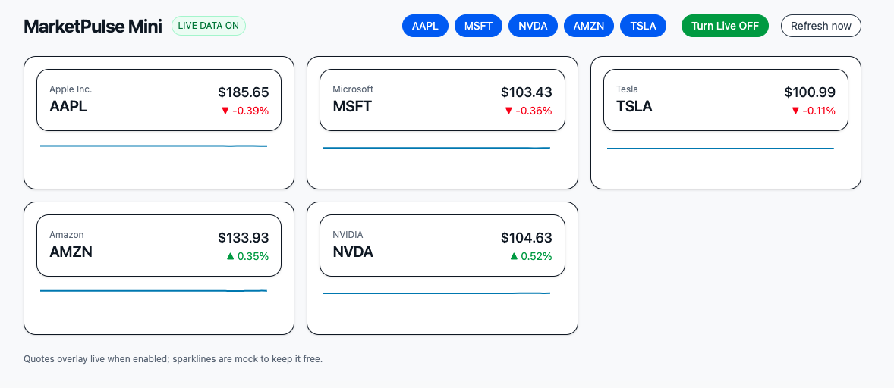

# 🧭 MarketPulse Mini

[](https://dkranzmat.github.io/marketpulse-mini/)

A lightweight finance dashboard built with **React**, **Vite**, and **Tailwind CSS** — displaying mock and live stock data in an elegant, responsive layout.

---

<p align="center">
  
</p>

---

### 🚀 Features
- ⚡ Instant mock price simulation (keeps sparklines free)
- 📈 Live price overlay via [Alpha Vantage API](https://www.alphavantage.co/)
- 💾 Local watchlist storage using Zustand
- 🎨 Clean UI with Tailwind and responsive grid
- 🧠 Built and deployed via GitHub Actions to GitHub Pages

---

### 🛠️ Tech Stack
- **React 18**
- **Vite 5**
- **Tailwind CSS 3**
- **Zustand** (state management)
- **GitHub Pages CI/CD** (auto deploy)

---

### 🔧 Local Setup
```bash
# Clone repo
git clone git@github.com:DKranzMAT/marketpulse-mini.git
cd marketpulse-mini

# Install dependencies
npm install

# Run locally
npm run dev

# Build for production
npm run build
```

Create a `.env` file for live data:
```
VITE_ALPHA_VANTAGE_KEY=your_api_key_here
```

---

### 🌐 Live Demo
**👉 [https://dkranzmat.github.io/marketpulse-mini/](https://dkranzmat.github.io/marketpulse-mini/)**

---

### 🧰 Author
**Dave Kranz**  
Front-End Developer | Data Visualization Enthusiast  
[Portfolio](https://davidkranzwordpress.com)

---

> _MarketPulse Mini_ — a micro-finance dashboard showcasing clean UX, state management, and CI/CD deployment.
